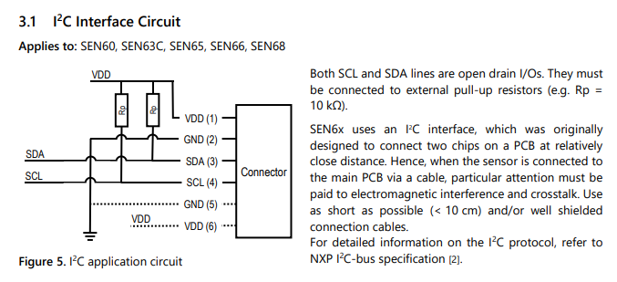
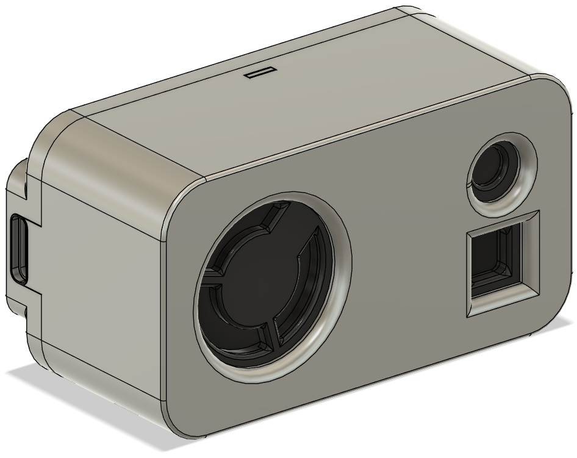

# General
- Air quality sensor.
- Sensor: Sensirion SEN66 (PM1, PM2.5, PM4, PM10, RH, Temp, VOC index, NOx index, CO2).
- MCU: Seeed Xiao ESP32-C6.
- Zigbee connection (lightweight IoT protocol).
- Using PlatformIO (Arduino IDE alternative).
- Using Arduino platform, because Espressif's C API is quite hard to understand.
- Home automation sensor - HomeAssistant preferably with Z2M.

Sample read:
```
PM1    : 30.3 ug/m3
PM2.5  : 33.4 ug/m3
PM4    : 34.8 ug/m3
PM10   : 35.5 ug/m3
RH     : 45.37 %
Temp.  : 22.73 C
VOC I. : 101
NOx I. : 1
CO2    : 1032 ppm
```

Sample view:


# Connection
- Connect Sensirion SEN66's I2C pins (SDA, SCL) to ESP and power it.  
- Add pull-up resistors (it worked without them in my case during development):  
  
- Build and upload the code to ESP.

# 3D Case Model
  

[3D Model](resources/SEN6x+ESP32C6.step)

# HA
Z2M:  


Due to the Arduino's Zigbee endpoint limitations, I created multiple endpoints with single clusters. Some of them are custom and that requires custom Z2M converter in HomeAssistant.

Z2M config converter `zigbee2mqtt\external_converters\sen66_custom.mjs` (auto registered):
[sen66_custom.mjs](resources/sen66_custom.mjs)

HA MQTT:  


> Rename optionally: click on sensor name -> Settings -> Name

# TODO  
- [x] Add 3D printable case.
- [ ] Create one Zigbee endpoint with multiple clusters. Use one of these:
  - Inherit, extend Arduino's `ZigbeeEP` (use `setEpConfig`?)
  - Use Espressif's C API directly (create a class and import in `main.cpp`)
- [ ] Remove endpoint suffixes in HA `sensor.air_quality_sensor_co2_18` (could be possibly fixed with single Zigbee endpoint, which seems to be better solution here).

# Docs
Sensirion SEN66:  
- [SEN66 Product Catalog](https://sensirion.com/products/catalog/SEN66)

More about Zigbee:  
- [Data model](https://wiki.seeedstudio.com/xiao_esp32c6_zigbee_arduino/#zigbee-data-model)  
- [HA Device types](https://docs.espressif.com/projects/esp-zigbee-sdk/en/latest/esp32/introduction.html#ha-automation-device-types)  
- [Available clusters](https://docs.espressif.com/projects/esp-zigbee-sdk/en/latest/esp32/introduction.html#zcl-clusters)  
- [Attributes and commands](https://docs.espressif.com/projects/esp-zigbee-sdk/en/latest/esp32/api-reference/zcl/index.html)  