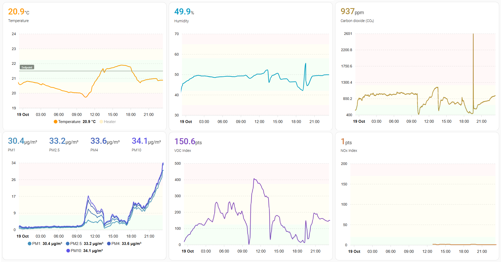
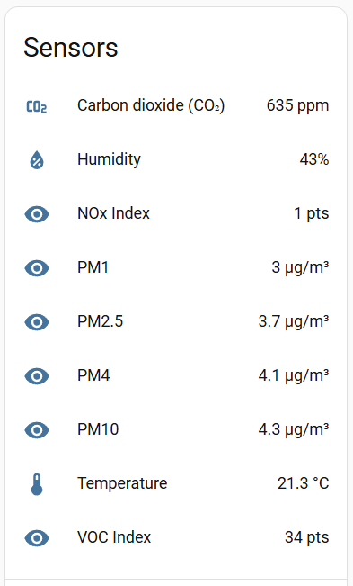

# General
- Air quality sensor.
- Sensor: Sensirion SEN66 (PM1, PM2.5, PM4, PM10, RH, Temp, VOC index, NOx index, CO2).
- MCU: Seeed Xiao ESP32-C6.
- Zigbee connection (lightweight IoT protocol).
- Using PlatformIO (Arduino IDE alternative).
- Using Arduino platform, because Espressif's C API is quite hard to understand.
- Home automation sensor - HomeAssistant preferably with Z2M.

Sample read:
```
PM1    : 30.3 ug/m3
PM2.5  : 33.4 ug/m3
PM4    : 34.8 ug/m3
PM10   : 35.5 ug/m3
RH     : 45.37 %
Temp.  : 22.73 C
VOC I. : 101
NOx I. : 1
CO2    : 1032 ppm
```

Sample view:



# Connection
- Connect Sensirion SEN66's I2C pins (SDA, SCL) to ESP and power it.  
- Add pull-up resistors (it worked without them in my case):  
  
- Build and upload the code to ESP.

# HA
Z2M:  


Due to the Arduino's Zigbee endpoint limitations, I created multiple endpoints with single clusters. Some of them are custom and that requires custom Z2M converter in HomeAssistant.

Z2M config converter `zigbee2mqtt\external_converters\sen66_custom.mjs` (auto registered):
```js
import { co2, deviceEndpoints, humidity, numeric, temperature } from "zigbee-herdsman-converters/lib/modernExtend";

export default {
  zigbeeModel: ["SEN66+ESP32-C6"],
  fingerprint: [{modelID: "SEN66+ESP32-C6", manufacturerName: "Custom"}],
  model: "SEN66+ESP32-C6",
  vendor: "Custom",
  description: "Air quality sensor",
  extend: [
    deviceEndpoints({endpoints: {12:12, 13:13, 14:14, 15:15, 16:16, 17:17, 18:18}}),
    numeric({
      access:"STATE_GET",
      endpointNames:["12"],
      cluster:"genAnalogInput", 
      attribute:"presentValue",
      label: "PM1",
      name:"PM1",
      unit:"µg/m³",
      precision: 1,
      reporting: {min: 60, max: 60 * 5, change: 0.1},
    }),
    numeric({
      access:"STATE_GET",
      endpointNames:["13"],
      cluster:"pm25Measurement",
      attribute:"measuredValue",
      label: "PM2_5",
      name:"PM2_5",
      unit:"µg/m³",
      precision: 1,
      reporting: {min: 60, max: 60 * 5, change: 0.1},
    }),
    numeric({
      access:"STATE_GET",
      endpointNames:["14"],
      cluster:"genAnalogInput",
      attribute:"presentValue",
      label: "PM4",
      name:"PM4",
      unit:"µg/m³",
      precision: 1,
      reporting: {min: 60, max: 60 * 5, change: 0.1},
    }),
    numeric({
      access:"STATE_GET",
      endpointNames:["15"],
      cluster:"genAnalogInput",
      attribute:"presentValue",
      label: "PM10",
      name:"PM10",
      unit:"µg/m³",
      precision: 1,
      reporting: {min: 60, max: 60 * 5, change: 0.1},
    }),
    humidity({
      reporting: {min: 60, max: 60 * 5, change: 0.1},
    }),
    temperature({
      reporting: {min: 60, max: 60 * 5, change: 0.1},
    }),
    numeric({
      access:"STATE_GET",
      endpointNames:["16"],
      cluster:"genAnalogInput",
      attribute:"presentValue",
      label: "VOC_Index",
      name:"VOC_Index",
      unit:"pts",
      reporting: {min: 60, max: 60 * 5, change: 1},
    }),
    numeric({
      access:"STATE_GET",
      endpointNames:["17"],
      cluster:"genAnalogInput",
      attribute:"presentValue",
      label: "NOx_Index",
      name:"NOx_Index",
      unit:"pts",
      reporting: {min: 60, max: 60 * 5, change: 1},
    }),
    co2({
      endpointNames:["18"],
      reporting: {min: 60, max: 60 * 5, change: 1},
    }),
  ],
  meta: {multiEndpoint: true},
};
```

HA MQTT:  


> Rename optionally: click on sensor name -> Settings -> Name

# TODO  
- [ ] Add 3D printable case.
- [ ] Create one Zigbee endpoint with multiple clusters. Use one of these:
  - Inherit, extend Arduino's `ZigbeeEP` (use `setEpConfig`?)
  - Use Espressif's C API directly (create a class and import in `main.cpp`)
- [ ] Remove endpoint suffixes in HA `sensor.air_quality_sensor_co2_18` (could be possibly fixed with single Zigbee endpoint, which seems to be better solution here).

# Docs
Sensirion SEN66:  
- [SEN66 Datasheet](https://sensirion.com/media/documents/FAFC548D/68C12881/Sensirion_Datasheet_SEN6x.pdf)
- [What is Sensirion’s VOC Index?](https://sensirion.com/media/documents/02232963/6294E043/Info_Note_VOC_Index.pdf)
- [What is Sensirion’s NOx Index?](https://sensirion.com/media/documents/9F289B95/6294DFFC/Info_Note_NOx_Index.pdf)
- [How can I integrate Sensirion’s VOC and/or NOx sensors into my air purifier?](https://sensirion.com/media/documents/ACD82D45/6294DFC0/Info_Note_Integration_VOC_NOx_Sensor.pdf)

More about Zigbee:  
- [Data model](https://wiki.seeedstudio.com/xiao_esp32c6_zigbee_arduino/#zigbee-data-model)  
- [HA Device types](https://docs.espressif.com/projects/esp-zigbee-sdk/en/latest/esp32/introduction.html#ha-automation-device-types)  
- [Available clusters](https://docs.espressif.com/projects/esp-zigbee-sdk/en/latest/esp32/introduction.html#zcl-clusters)  
- [Attributes and commands](https://docs.espressif.com/projects/esp-zigbee-sdk/en/latest/esp32/api-reference/zcl/index.html)  